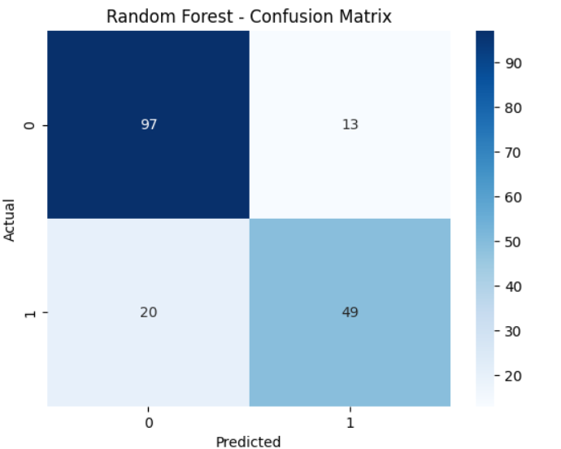
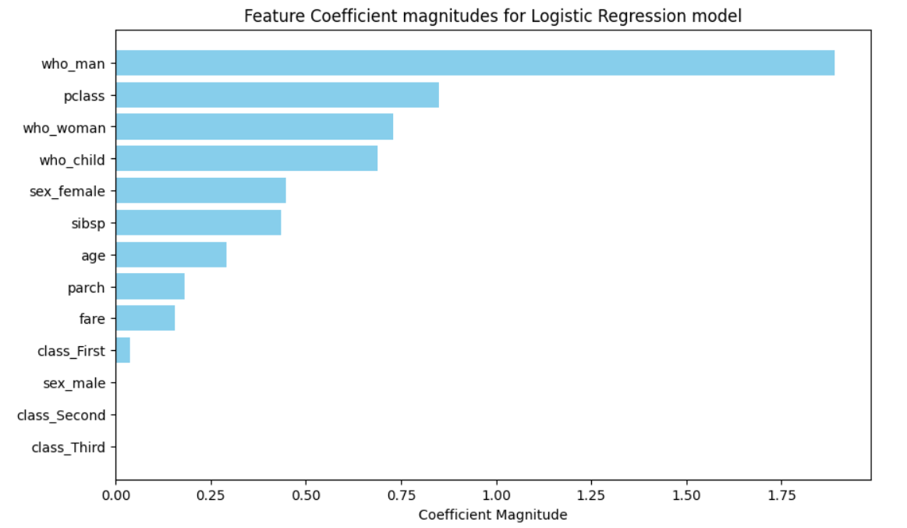
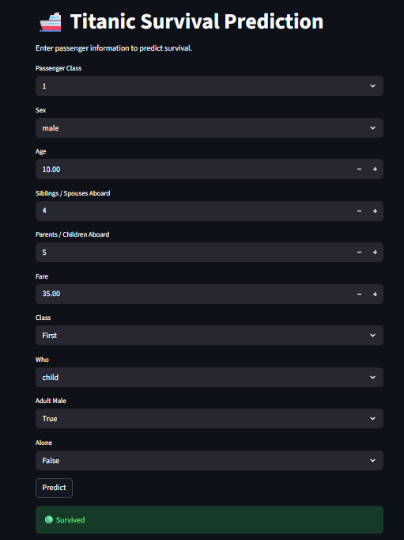

# Titanic Survival Prediction

## Description

Machine Learning project to predict whether a passenger survived the Titanic disaster based on passenger information.

## Technologies

* Python
* Pandas
* NumPy
* Scikit-learn
* Matplotlib
* Seaborn
* Streamlit

## Steps

* Data loading and exploration
* Data preprocessing and cleaning
* Handling missing values
* Feature selection
* Data visualization
* Model training
* Model evaluation
* Building a web interface using Streamlit

## Model

* Logistic Regression

## Evaluation

* Accuracy
* Classification Report
* Confusion Matrix

## 📊 Confusion Matrix

## 📈 Data Visualization

The project includes visualizations to explore the relationship between passenger features and survival.

## 🌐 Web Interface

The project includes a simple web interface built with **Streamlit**. Users can enter passenger information and the trained model predicts whether the passenger survived or did not survive.

